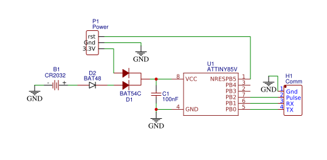

# Pulse counter

Code is AS-IS without any warranty of any kind...

Primarily created for the french Gas Smartmeter 'Gazpar' but can be used for any meter based on pulses (via a dry contact output) like "dumb" gas meters, water meters, etc...

# Hardware

# Schematics

# PCB

**Beware, this PCB was designed for fun. It hasn't been tested _at all_!**

[Link to project on EasyEDA](https://easyeda.com/fguillier/autonomous-pulse-counter)

